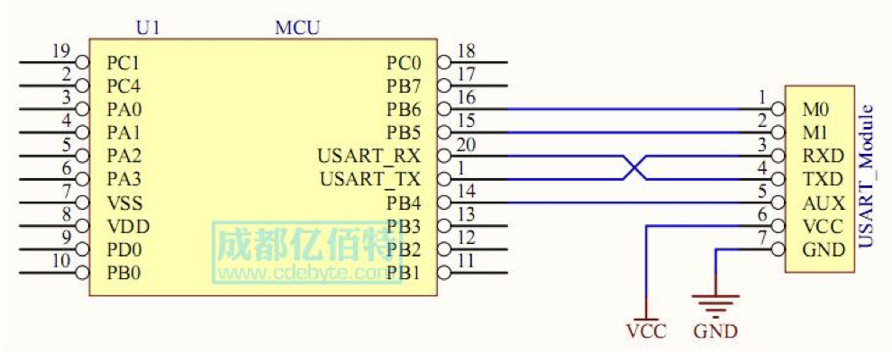
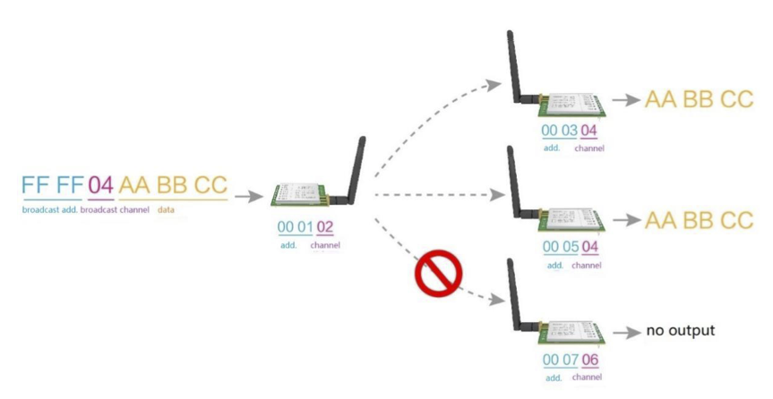

## Tests with SX1276 at 868MHz (868T20D)

The 868T20D has a maximal distance of 3km.

There is a better model that is available (868T30D) and that could reach 8km.

- Channel (DEC): 32
- Default channel (DEC): 8
- Default module address: 65536
- Air data rate: 2.4 (default), allowed values: 0.3, 1.2, 2.4, 4.8, 9.6, 19.2
- Sub packet max size: 58
- Transmission current: 110-130 mA
- Receiving current: 13-15 mA
- Turn off current: 3-5 µA
- Voltage supply: 2.3-5.2 V
- Communication level: 2.5-3.6 V
- Transmitting power: 19.3-20.6 dBm
- Receiving sensitivity: -144 - -147
- Recommended working frequency: 862 - 893 MHz
- Tested range: 2700 - 3300 m
- Serial communication 9600 8N1

## Recommended circuit diagram

## Mode

### Fixed

### Broadcast

- Broadcast address: 0x0000 or 0xFFFF
- Monitoring address: 0x0000 or 0xFFFF
